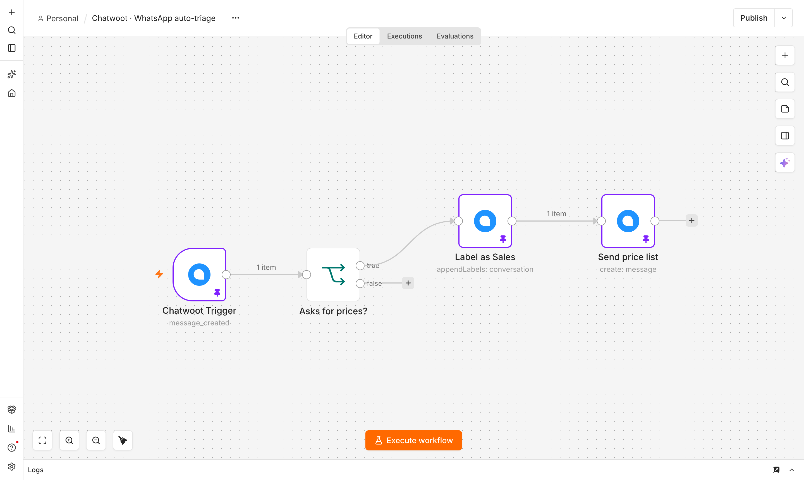
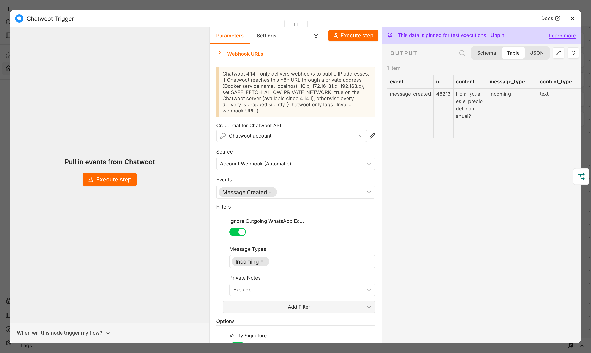
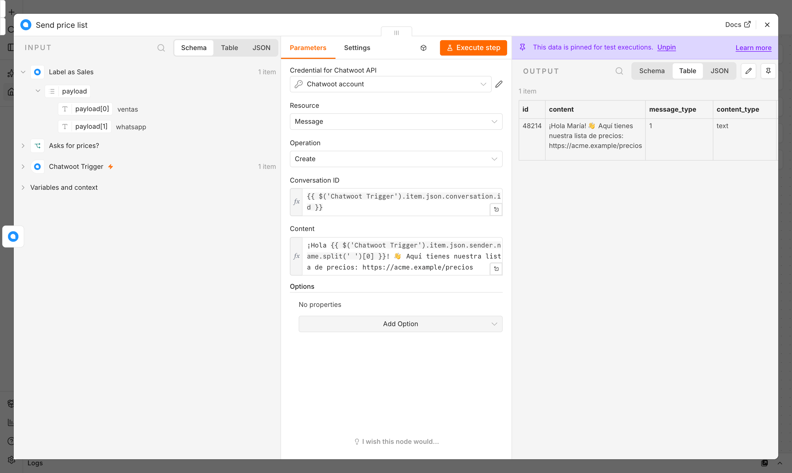
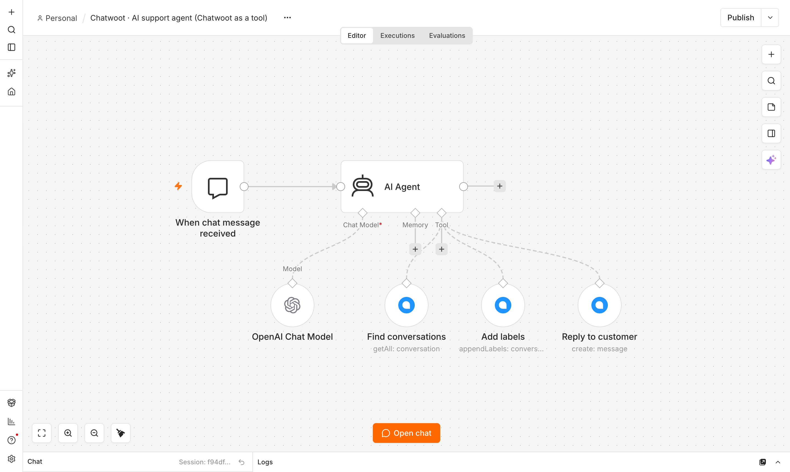
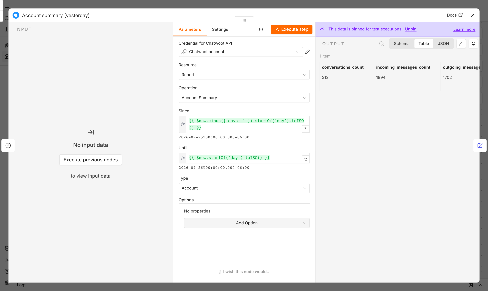

# n8n-nodes-chatwoot

[](https://www.npmjs.com/package/@renatoascencio/n8n-nodes-chatwoot)
[](https://www.npmjs.com/package/@renatoascencio/n8n-nodes-chatwoot)
[](https://opensource.org/licenses/MIT)
[](https://docs.n8n.io/integrations/community-nodes/)

<p align="center">
  
</p>

A comprehensive n8n community node for [Chatwoot](https://www.chatwoot.com/) - the open-source customer engagement platform. Automate your customer support workflows with full access to conversations, messages, contacts, agents, teams, and more.

[n8n](https://n8n.io/) is a [fair-code licensed](https://docs.n8n.io/reference/license/) workflow automation platform.

---

## Highlights

- **39 Resources** - Comprehensive coverage of Application, Platform, and Public APIs
- **260+ Operations** - Complete CRUD operations for all resources, verified against Chatwoot 4.13–4.18
- **3 API Types** - Application API (v1 + v2), Platform API, and Public API support
- **AI Agent Tool** - The Chatwoot node can be attached as a tool to n8n's AI Agent node
- **Trigger Node** - Account webhooks *or* a manually-configured Agent Bot/API Channel URL, with HMAC signature verification, 12 event types, and delivery filters
- **Automatic Retries** - Exponential backoff on `429`/`502`/`503`/`504`, honoring `Retry-After`
- **Reports v2** - Full coverage of `/api/v2/reports`, `/live_reports`, `/summary_reports`
- **WhatsApp Templates & Attachments** - `template_params` for template messages, binary attachments and voice notes for regular messages
- **Dynamic Dropdowns** - Auto-populated lists for agents, teams, inboxes, and labels
- **Smart Pagination** - Automatic handling with "Return All" option
- **Reports & Analytics** - Access conversation and agent statistics
- **Help Center** - Manage portals, categories, and articles
- **Detailed Error Messages** - Chatwoot's own error message and description, not a generic one

## Screenshots

Taken in n8n 2.40.7 with the example workflows in [`examples/workflows`](examples/workflows) (sample data is fictional and pinned, so you can open them without a Chatwoot server).

**WhatsApp auto-triage** — the trigger filters incoming messages, then the node labels the conversation and replies:



| Chatwoot Trigger: events, filters and signature verification | Message › Create with the pinned output |
|---|---|
|  |  |

| AI Agent with Chatwoot tools (`$fromAI`) | Report › Account Summary |
|---|---|
|  |  |

---

## Table of Contents

- [Screenshots](#screenshots)
- [Installation](#installation)
- [Configuration](#configuration)
- [Nodes](#nodes)
  - [Chatwoot Node](#chatwoot-node)
  - [Chatwoot Trigger](#chatwoot-trigger)
- [Resources & Operations](#resources--operations)
- [Trigger Reference](#trigger-reference)
- [Using the Chatwoot Node as an AI Agent Tool](#using-the-chatwoot-node-as-an-ai-agent-tool)
- [Using with Evolution API (WhatsApp)](#using-with-evolution-api-whatsapp)
- [Compatibility](#compatibility)
- [Usage Examples](#usage-examples)
- [Troubleshooting](#troubleshooting)
- [Development](#development)
- [Release Process](#release-process)
- [Contributing](#contributing)
- [License](#license)

---

## Installation

> **n8n 3.0 (October 2026)**: unverified community packages are disabled by default
> (`N8N_UNVERIFIED_PACKAGES_ENABLED` defaults to `false`, down from `true` on 2.x). Until this
> package is verified by n8n, set `N8N_UNVERIFIED_PACKAGES_ENABLED=true` on your n8n instance to
> keep installing or updating it — otherwise the install fails and n8n 3.0 also refuses to load an
> already-installed unverified package. This has no effect on n8n 2.x.

### Community Nodes (Recommended)

1. Go to **Settings > Community Nodes** in your n8n instance
2. Select **Install**
3. Enter `@renatoascencio/n8n-nodes-chatwoot`
4. Accept the risks and select **Install**

### Manual Installation

```bash
# For self-hosted n8n
cd ~/.n8n/nodes
npm install @renatoascencio/n8n-nodes-chatwoot

# Restart n8n
```

### Docker

Add to your `docker-compose.yml`:

```yaml
environment:
  - N8N_CUSTOM_EXTENSIONS=@renatoascencio/n8n-nodes-chatwoot
```

Or install in a running container:

```bash
docker exec -it n8n npm install -g @renatoascencio/n8n-nodes-chatwoot
docker restart n8n
```

---

## Configuration

This node supports three types of credentials for different API access levels:

### 1. Chatwoot API (Application API)

Used for most operations - managing conversations, contacts, messages, teams, etc.

1. In n8n, go to **Credentials > Add Credential**
2. Search for **Chatwoot API**
3. Fill in the required fields:

| Field | Description | Example |
|-------|-------------|---------|
| **Base URL** | Your Chatwoot instance URL | `https://app.chatwoot.com` or `https://chatwoot.yourdomain.com` |
| **Account ID** | Your Chatwoot account ID | Found in URL: `/app/accounts/1/...` |
| **API Access Token** | Your personal API token | Found in Profile Settings |

**Getting Your API Access Token:**
1. Log in to Chatwoot
2. Click your **profile icon** (bottom left)
3. Go to **Profile Settings**
4. Scroll to **Access Token**
5. Copy or regenerate your token

### 2. Chatwoot Platform API

Used for platform-level operations - managing accounts, platform users, and account agent bots. Requires super admin access.

| Field | Description | Example |
|-------|-------------|---------|
| **Base URL** | Your Chatwoot instance URL | `https://app.chatwoot.com` |
| **Platform API Token** | Super admin platform token | Found in Super Admin settings |

### 3. Chatwoot Public API

Used for client-side operations without an agent login: creating contacts, starting conversations,
and sending messages from an external system. **The Public API only works with API channel inboxes**
(`Channel::Api`) — this is the inbox type Evolution API and other WhatsApp bridges create, and the
one you get from Chatwoot's **Inboxes > Add Inbox > API**. Website (web widget), Email, Telegram and
other inbox types answer 404 for every Public API call.

| Field | Description | Example |
|-------|-------------|---------|
| **Base URL** | Your Chatwoot instance URL | `https://app.chatwoot.com` |
| **Inbox Identifier** | The API inbox's identifier (a random token, not the numeric inbox ID) | Settings → Inboxes → your inbox → Configuration |
| **HMAC Token** | Optional. The inbox's identity validation secret (Configuration → Identity Validation) | Only needed if the inbox enforces identity validation |

When **HMAC Token** is set, Public Contact operations compute `identifier_hash` automatically for
any contact created or updated with an **Identifier**, which an inbox enforcing identity validation
requires — otherwise Chatwoot rejects the request.

> **Note**: Keep your API tokens secure. They provide access to your Chatwoot account.

---

## Nodes

### Chatwoot Node

The main node for interacting with Chatwoot APIs. Supports 38 resources across three API types:
- **Application API** (31 resources) - Core operations for conversations, contacts, messages, macros, notifications, campaigns, companies, SLA policies, applied SLAs, global search, reports v2, live reports, summary reports, etc.
- **Platform API** (4 resources) - Admin operations for accounts, users, and agent bots
- **Public API** (3 resources) - Client-side operations for widgets and external integrations

### Chatwoot Trigger

Webhook-based trigger that starts workflows when events occur in Chatwoot. See
[Trigger Reference](#trigger-reference) below for the full reference: sources, signature
verification, events and filters.

---

## Resources & Operations

### Account

Manage your Chatwoot account settings.

| Operation | Description |
|-----------|-------------|
| **Get** | Get account information |
| **Update** | Update account settings (name, locale, support email, auto-resolve duration) |

### Agent

Manage team members and their settings.

| Operation | Description |
|-----------|-------------|
| **Get Many** | List all agents in the account |
| **Create** | Add a new agent (requires email, name, role) |
| **Update** | Modify agent settings (role, availability, auto-offline) |
| **Delete** | Remove an agent from the account |

### Canned Response

Manage pre-saved response templates.

| Operation | Description |
|-----------|-------------|
| **Get Many** | List all canned responses |
| **Create** | Create a new canned response (short code + content) |
| **Update** | Modify an existing canned response |
| **Delete** | Remove a canned response |

### Contact

Full contact management with search and merge capabilities.

| Operation | Description |
|-----------|-------------|
| **Create** | Create a new contact (requires inbox_id) |
| **Get** | Retrieve a contact by ID |
| **Get Many** | List all contacts with pagination |
| **Update** | Modify contact details |
| **Delete** | Remove a contact |
| **Search** | Find contacts by name, email, phone, or identifier |
| **Get Conversations** | List all conversations for a contact |
| **Merge** | Merge two contacts into one |
| **Filter** | Filter contacts with advanced criteria |
| **Add Labels** | Add labels to a contact, keeping its existing ones |
| **Remove Labels** | Remove labels from a contact, keeping the rest |
| **Set Labels** | Replace all of a contact's labels with the given list (an empty list clears them) — this is the original v0.8.3 "Add Labels" behavior, kept under its original parameter value for saved workflows |
| **List Labels** | Get all labels for a contact |
| **Import** | Import contacts from a CSV file (multipart binary upload) |
| **Export** | Export contacts as CSV |
| **Contactable Inboxes** | Get inboxes that can reach a contact |

### Conversation

Manage customer conversations with assignment and labeling.

| Operation | Description |
|-----------|-------------|
| **Get** | Get a single conversation with full details |
| **Get Many** | List conversations with filters (status, inbox, team, labels, search) |
| **Create** | Create a new conversation |
| **Update Status** | Change status to open, resolved, pending, or snoozed |
| **Update** | Update conversation (custom attributes, team, etc.) |
| **Assign** | Assign to an agent, a team, an Agent Bot, or a Captain (AI) Assistant |
| **Add Labels** | Add labels to a conversation, keeping its existing ones |
| **Remove Labels** | Remove labels from a conversation, keeping the rest |
| **Set Labels** | Replace all of a conversation's labels with the given list — this is the original v0.8.3 "Add Labels" behavior, kept under its original parameter value for saved workflows |
| **List Labels** | Get all labels for a conversation |
| **Toggle Priority** | Set conversation priority (urgent, high, medium, low, none) |
| **Filter** | Filter conversations with advanced criteria |
| **Update Custom Attributes** | Set custom attributes on a conversation. **Merge With Existing** (off by default, matching v0.8.3) merges into the current attributes instead of replacing them (Chatwoot 4.17+) |
| **Get Meta** | Get conversation metadata |
| **Mute** | Mute a conversation |
| **Unmute** | Unmute a conversation |
| **Delete** | Delete a conversation |
| **Search** | Search conversations by query |
| **Transcript** | Send conversation transcript via email |
| **Toggle Typing** | Show/hide typing indicator |

### Custom Attribute

Manage custom fields for contacts and conversations.

| Operation | Description |
|-----------|-------------|
| **Get Many** | List all custom attributes |
| **Get** | Get a specific attribute by key |
| **Create** | Create a new custom attribute |
| **Update** | Modify an existing attribute |
| **Delete** | Remove a custom attribute |

### Inbox

Manage communication channels.

| Operation | Description |
|-----------|-------------|
| **Get Many** | List all inboxes |
| **Get** | Get inbox details |
| **Create** | Create a new inbox |
| **Update** | Modify inbox settings (name, greeting, auto-assignment, etc.) |
| **Add Agent** | Add an agent to an inbox |
| **Delete Agent** | Remove an agent from an inbox |
| **Update Agents** | Replace the inbox's whole agent list in one call |
| **Get Members** | List inbox members |
| **Get Agent Bot** | Get associated agent bot |
| **Set Agent Bot** | Associate an agent bot with inbox |

### Label

Organize conversations and contacts with labels.

| Operation | Description |
|-----------|-------------|
| **Get Many** | List all labels |
| **Create** | Create a new label (title, color, description) |
| **Update** | Modify label properties |
| **Delete** | Remove a label |

### Message

Send and retrieve messages in conversations.

| Operation | Description |
|-----------|-------------|
| **Create** | Send a message: text, private notes, WhatsApp template params, attachments (from binary properties, sent as `multipart/form-data`), an audio attachment as a voice message, or `content_attributes` |
| **Get Many** | Retrieve message history with cursor-based pagination |
| **Update Delivery Status** | Set a message's delivery status (Sent/Delivered/Read/Failed) — Chatwoot's inbox-API endpoint only updates status, not content |
| **Retry** | Resend a failed outgoing message |
| **Delete** | Delete a message |

> **WhatsApp template messages** (since v0.8.1): use the `template_params` JSON option with format `{"name": "template_name", "category": "MARKETING|UTILITY|AUTHENTICATION", "language": "en_US", "processed_params": {"1": "value1", "2": "value2"}}`.
>
> **Attachments** (since v0.9.0): add one or more binary properties from a previous node (e.g. an HTTP Request or Read Binary File output) to **Attachments (Binary Properties)** as a comma-separated list. Turn on **Send Audio as Voice Message** to send an audio attachment as a Chatwoot voice note.

### Team

Manage agent teams for conversation routing.

| Operation | Description |
|-----------|-------------|
| **Get Many** | List all teams |
| **Get** | Get team details |
| **Create** | Create a new team |
| **Update** | Modify team settings |
| **Delete** | Remove a team |
| **Add Agent** | Add an agent to a team |
| **Delete Agent** | Remove an agent from a team |
| **Get Members** | List team members |
| **Update Agents** | Update team agent memberships |

### Webhook

Manage webhook subscriptions programmatically.

| Operation | Description |
|-----------|-------------|
| **Get Many** | List all webhooks |
| **Create** | Register a new webhook URL with event subscriptions |
| **Update** | Modify webhook URL or subscriptions |
| **Delete** | Remove a webhook |

### Agent Bot

Manage AI agent bots.

| Operation | Description |
|-----------|-------------|
| **Get Many** | List all agent bots |
| **Get** | Retrieve an agent bot by ID |
| **Create** | Create a new agent bot |
| **Update** | Modify agent bot settings |
| **Delete** | Remove an agent bot |

### Automation Rule

Manage automation rules for conversations.

| Operation | Description |
|-----------|-------------|
| **Get Many** | List all automation rules |
| **Get** | Retrieve an automation rule by ID |
| **Create** | Create a new automation rule |
| **Update** | Modify automation rule settings |
| **Delete** | Remove an automation rule |

### Custom Filter

Manage saved filters for conversations and contacts.

| Operation | Description |
|-----------|-------------|
| **Get Many** | List all custom filters |
| **Get** | Retrieve a custom filter by ID |
| **Create** | Create a new custom filter |
| **Update** | Modify filter settings |
| **Delete** | Remove a custom filter |

### Report

Access analytics and reporting data via Chatwoot's `/api/v2/reports` endpoints. **Now correctly routed through v2** (was broken in v0.3.0–v0.7.x — see [v0.8.0 release notes](https://github.com/RenatoAscencio/n8n-nodes-chatwoot/releases/tag/v0.8.0)).

| Operation | Description |
|-----------|-------------|
| **Account Summary** | Period comparison summary (current vs previous) |
| **Timeseries** | Timeseries data for a metric |
| **Bot Summary** | Bot-specific summary metrics |
| **Bot Metrics** | Bot performance metrics |
| **Agent Statistics** | Per-agent summary (CSV) |
| **Inbox Statistics** | Per-inbox summary (CSV) |
| **Label Statistics** | Per-label summary (CSV) |
| **Team Statistics** | Per-team summary (CSV) |
| **Conversation Statistics** | Conversation metrics by type |
| **Conversations Summary** | Conversation summary (CSV) |
| **Conversation Traffic** | Hourly heatmap (CSV) |
| **Inbox Label Matrix** | Cross-tabulation of inboxes vs labels |
| **First Response Time Distribution** | Distribution of first response times |
| **Outgoing Messages Count** | Outgoing counts grouped by entity |
| **Year in Review** | Annual review statistics |
| **Conversation Counts** | Conversation counts by status (uses v1 `/conversations/meta`) |

### Live Report

Real-time conversation metrics (no date range needed).

| Operation | Description |
|-----------|-------------|
| **Conversation Metrics** | Real-time counts (open, unattended, unassigned, pending) |
| **Grouped Conversation Metrics** | Real-time counts grouped by team or agent |

### Summary Report

Per-entity summary metrics with date range (JSON, max 6-month range for channel).

| Operation | Description |
|-----------|-------------|
| **Agent Summary** | Per-agent summary metrics |
| **Team Summary** | Per-team summary metrics |
| **Inbox Summary** | Per-inbox summary metrics |
| **Label Summary** | Per-label summary metrics |
| **Channel Summary** | Per-channel summary metrics |

### Applied SLA (Enterprise)

Track SLA compliance per conversation.

| Operation | Description |
|-----------|-------------|
| **Get Many** | List applied SLAs (paginated) |
| **Metrics** | SLA hit rate metrics |
| **Download** | Export breached conversations as CSV |

### Profile

Manage user profile.

| Operation | Description |
|-----------|-------------|
| **Fetch** | Get the authenticated user's profile |

### Help Center

Manage knowledge base content.

| Operation | Description |
|-----------|-------------|
| **Create Portal** | Create a new help center portal |
| **Get Portal** | Retrieve portal details by slug |
| **Update Portal** | Modify portal settings |
| **Create Category** | Add a category to a portal |
| **Create Article** | Add an article to a portal |

### Integration

Manage integrations (Dialogflow, Slack, etc.).

| Operation | Description |
|-----------|-------------|
| **Get Many** | List all integrations |
| **Create Hook** | Create an integration hook |
| **Update Hook** | Modify hook settings |
| **Delete Hook** | Remove an integration hook |

### Audit Log

Access account activity logs.

| Operation | Description |
|-----------|-------------|
| **Get Many** | Retrieve account audit logs |

### CSAT Survey

Access customer satisfaction surveys.

| Operation | Description |
|-----------|-------------|
| **Get** | Get CSAT survey for a conversation |
| **Metrics** | Get CSAT survey metrics summary |
| **Download** | Download CSAT survey responses |

### Macro

Manage reusable action sequences.

| Operation | Description |
|-----------|-------------|
| **Get Many** | List all macros |
| **Get** | Retrieve a macro by ID |
| **Create** | Create a new macro with actions |
| **Update** | Modify macro settings |
| **Delete** | Remove a macro |
| **Execute** | Execute a macro on a conversation |

### Notification

Manage agent notifications.

| Operation | Description |
|-----------|-------------|
| **Get Many** | List notifications (with read/snoozed filters) |
| **Mark Read** | Mark a notification as read |
| **Mark Unread** | Mark a notification as unread |
| **Mark All Read** | Mark all notifications as read |
| **Delete** | Remove a notification |
| **Unread Count** | Get count of unread notifications |

### Campaign

Manage outbound campaigns.

| Operation | Description |
|-----------|-------------|
| **Get Many** | List all campaigns |
| **Get** | Retrieve a campaign by ID |
| **Create** | Create a new campaign |
| **Update** | Modify campaign settings |
| **Delete** | Remove a campaign |

### Contact Note

Manage notes on contacts.

| Operation | Description |
|-----------|-------------|
| **Get Many** | List all notes for a contact |
| **Create** | Create a note on a contact |
| **Update** | Modify a contact note |
| **Delete** | Remove a contact note |

### Conversation Participant

Manage conversation watchers/participants.

| Operation | Description |
|-----------|-------------|
| **Get Many** | List participants of a conversation |
| **Add** | Add participants to a conversation |
| **Remove** | Remove participants from a conversation |

### Company (Enterprise)

Manage B2B companies. Requires Chatwoot Enterprise.

| Operation | Description |
|-----------|-------------|
| **Get Many** | List all companies with sorting |
| **Get** | Retrieve a company by ID |
| **Create** | Create a new company |
| **Update** | Modify company settings |
| **Delete** | Remove a company |
| **Search** | Search companies by name or domain |

### SLA Policy (Enterprise)

Manage SLA policies. Requires Chatwoot Enterprise.

| Operation | Description |
|-----------|-------------|
| **Get Many** | List all SLA policies |
| **Get** | Retrieve an SLA policy by ID |
| **Create** | Create an SLA policy with thresholds |
| **Update** | Modify SLA policy settings |
| **Delete** | Remove an SLA policy |

### Search (Global)

Search across all entities.

| Operation | Description |
|-----------|-------------|
| **Search All** | Search across conversations, contacts, and messages |
| **Search Conversations** | Search conversations only |
| **Search Contacts** | Search contacts only |
| **Search Messages** | Search messages only |

---

## Platform API Resources

These resources require the **Chatwoot Platform API** credential.

### Platform Account

Manage accounts at the platform level.

| Operation | Description |
|-----------|-------------|
| **Create** | Create a new account |
| **Get** | Retrieve account details |
| **Update** | Modify account settings |
| **Delete** | Remove an account |

### Platform User

Manage users at the platform level.

| Operation | Description |
|-----------|-------------|
| **Create** | Create a new platform user |
| **Get** | Retrieve user details |
| **Update** | Modify user settings |
| **Delete** | Remove a user |
| **Get SSO URL** | Generate SSO login URL |

### Account User

Manage users within a specific account.

| Operation | Description |
|-----------|-------------|
| **Get Many** | List all users in an account |
| **Create** | Add a user to an account |
| **Delete** | Remove a user from an account |

### Account Agent Bot

Manage agent bots at the account level.

| Operation | Description |
|-----------|-------------|
| **Get Many** | List all account agent bots |
| **Get** | Retrieve an agent bot by ID |
| **Create** | Create a new account agent bot |
| **Update** | Modify agent bot settings |
| **Delete** | Remove an account agent bot |

---

## Public API Resources

These resources require the **Chatwoot Public API** credential.

### Public Contact

Manage contacts via the public API. When the credential's **HMAC Token** is set, Create and Update
compute `identifier_hash` automatically for a contact sent with an **Identifier**.

| Operation | Description |
|-----------|-------------|
| **Create** | Create a contact via public API |
| **Get** | Retrieve contact details |
| **Update** | Update contact information |

### Public Conversation

Manage conversations via the public API.

| Operation | Description |
|-----------|-------------|
| **Create** | Create a conversation via public API |
| **Get** | Retrieve a conversation |
| **Get Many** | List all conversations for a contact |
| **Get CSAT Survey** | Get the CSAT survey for a conversation, by its UUID |
| **Submit CSAT Survey** | Submit a rating (and optional feedback) for a CSAT survey |
| **Resolve** | Resolve/toggle conversation status |
| **Toggle Typing** | Show typing indicator |
| **Update Last Seen** | Mark messages as seen |

### Public Message

Manage messages via the public API.

| Operation | Description |
|-----------|-------------|
| **Create** | Send a message via public API, optionally with attachments |
| **Get Many** | List messages in a conversation, with cursor-based pagination (previously capped at the last 20 messages) |
| **Update** | Update a message's `submitted_values` (the answer to a form/input message) |

### [Public] Inbox

Read the public settings of the credential's API inbox — no side effects.

| Operation | Description |
|-----------|-------------|
| **Get** | Get the inbox's name, timezone, working hours, and whether CSAT surveys, greetings and identity validation are enabled |

---

## Trigger Reference

The Chatwoot Trigger has two delivery **Source**s. Both verify Chatwoot's HMAC signature by default.

### Account Webhook (Automatic) — the default

n8n creates a Chatwoot account webhook for this trigger's URL when the workflow is activated,
stores its signing secret, and deletes the webhook when the workflow is deactivated. This needs an
administrator API access token (on Chatwoot Cloud, a plan with API and webhooks). Reactivating the
workflow, or renaming it, reuses or re-adopts the existing webhook instead of creating a duplicate.

**Events:** Contact Created/Updated, Conversation Created/Updated/Status Changed, Conversation
Typing On/Off, Inbox Created/Updated (only sent when the Chatwoot server sets
`ENABLE_INBOX_EVENTS`), Message Created/Updated, Webwidget Triggered.

### Agent Bot / API Channel (Manual URL)

Paste this trigger's Production URL (or the Test URL while testing) directly into an **Agent
Bot**'s Webhook URL (Settings > Bots), an **API Channel inbox**'s Webhook URL (Settings > Inboxes >
the inbox > Settings — this is the inbox type Evolution API creates), or a webhook you manage by
hand in Settings > Integrations > Webhooks. n8n registers nothing in Chatwoot for this source; you
provide the **Signing Secret** yourself (Chatwoot shows it as `secret` on the agent bot or inbox,
or when you create a webhook). Do not use this source's URL as an account webhook target, and don't
use the Account Webhook source's URL as an agent bot/API channel target — each signs with its own
secret and Chatwoot rejects the other with HTTP 401.

This source has its own, larger event list, since agent bots, API channels and account webhooks
each fire a different subset: it adds **Conversation Opened** and **Conversation Resolved**
(agent-bot handoff events, not available on the Account Webhook source), and leaves out events an
agent bot or API channel never sends (Contact Created/Updated, Inbox Created/Updated). An error
response from this workflow (inactive workflow, invalid signature) makes Chatwoot mark the delivery
as failed — for an agent bot, pending conversations move back to Open unless the account keeps them
pending on bot failure.

### Signature verification and options

| Option | Default | Notes |
|--------|---------|-------|
| **Verify Signature** | On | Rejects deliveries whose `X-Chatwoot-Signature`/`X-Chatwoot-Timestamp` don't match the signing secret. Turn off only for a server that never signs its requests (no secret configured). |
| **Signature Tolerance (Seconds)** | 300 | How far a delivery's timestamp may drift before it's rejected as stale/replayed. |
| **Include Raw Body** | Off | Adds `rawBody` as the parsed JSON object — the v0.8.3 behavior, since that version always included it. |
| **Include Raw Body Text** | Off | Adds `rawBodyText`: the exact bytes Chatwoot signed, for verifying the signature yourself further downstream. |
| **Redact Channel Secrets** | On | Strips channel credentials from Inbox Created/Updated payloads before they reach the workflow. |
| **Include Delivery Info** | Off | Adds delivery metadata (source, whether the signature was verified, retry count). |

### Filters

Filters apply after the event-type check and narrow which matching events actually start the
workflow (everything else is answered `200 OK` and ignored, so Chatwoot doesn't retry it):

- **Inbox IDs** — only these inboxes.
- **Sender Types** — Contact / Agent / Agent Bot.
- **Message Types** — Incoming / Outgoing / Template / Activity.
- **Private Notes** — include, exclude, or only private notes.
- **Ignore Messages From User IDs** — drop messages sent by specific agent/bot user IDs (for
  example, to stop a workflow from reacting to its own replies).
- **Ignore Outgoing WhatsApp Echoes (Evolution API)** — Evolution API relays every outbound message
  back to Chatwoot as its own `message_created` event; turn this on to drop those echoes so the
  trigger only fires for messages that didn't originate from this same workflow.

### SafeFetch (Chatwoot 4.14+)

Chatwoot 4.14 and later only deliver webhooks to publicly-routable addresses (its anti-SSRF
"SafeFetch" filter). If Chatwoot can only reach this n8n instance through a private address (a
Docker service name, `localhost`, `10.x`, `172.16–31.x`, `192.168.x`), every delivery is dropped
**silently** — Chatwoot logs "Invalid webhook URL" on its side and n8n never receives anything.
Set `SAFE_FETCH_ALLOW_PRIVATE_NETWORK=true` on the Chatwoot server (available since 4.14.1) to
allow it. The trigger node shows a notice about this when its computed webhook URL looks private.

---

## Using the Chatwoot Node as an AI Agent Tool

The Chatwoot node declares `usableAsTool: true`, so it can be connected to the **Tool** input of an
**AI Agent** node (or any other node that accepts sub-node tools) instead of only running as a
regular workflow step. Connect it like any other tool sub-node, then either:

- Pin **Resource** and **Operation** and let the agent fill in the remaining parameters (for
  example, always **Message > Create** on a fixed conversation, letting the model write the
  **Content**), or
- Set the node's parameters to expressions the model fills in through the tool's schema, for a more
  general-purpose tool (e.g. "search contacts", "create a conversation", "add a label").

Every operation the node otherwise supports is available this way — there's no separate "AI tool"
mode. The usual guidance for tool-enabled community nodes applies: keep the exposed surface to the
handful of operations the agent actually needs (one Chatwoot node per operation is easier for a
model to use reliably than one node with 39 resources and 230+ operations all exposed at once).

---

## Using with Evolution API (WhatsApp)

[Evolution API](https://github.com/EvolutionAPI/evolution-api) is a common way to connect WhatsApp
to Chatwoot: it creates an **API channel inbox** (`Channel::Api`) in Chatwoot and relays messages
both ways. A few things behave differently for these inboxes compared to a native Chatwoot channel:

- **Contact identifier is the JID.** For a WhatsApp contact created through Evolution, the
  contact's `identifier` is the WhatsApp JID (e.g. `5215512345678@s.whatsapp.net`), not an
  arbitrary ID from your own CRM. Search and merge operations that match on `identifier` need the
  JID, not a customer/CRM ID.
- **Typing indicators aren't relayed to WhatsApp.** Chatwoot's Conversation > Toggle Typing calls
  the standard API-channel typing endpoint, but Evolution doesn't forward
  `conversation_typing_on`/`off` to the WhatsApp client, so the contact never sees a "typing…"
  indicator, even though the call itself succeeds.
- **Outbound-message echoes.** Evolution can relay a message n8n just sent back into Chatwoot as
  its own incoming `message_created` webhook event, which would otherwise make an
  "auto-reply" trigger workflow fire on its own replies. Turn on the Chatwoot Trigger's
  **Ignore Outgoing WhatsApp Echoes (Evolution API)** filter to drop these.
- **Attachments.** Use Message > Create's **Attachments (Binary Properties)** field to send images,
  documents or audio; turn on **Send Audio as Voice Message** for a WhatsApp voice note instead of
  a regular audio attachment.
- **Use the Public API for contact-facing automations** (for example, a bot that creates
  conversations or messages as the contact rather than as an agent): it only works with API channel
  inboxes, which is exactly what Evolution creates — see [Chatwoot Public API](#3-chatwoot-public-api) above.
- Chatwoot 4.14+'s SafeFetch also applies to the webhook Evolution itself receives from
  Chatwoot and to the Chatwoot Trigger's own URL — see [SafeFetch](#safefetch-chatwoot-414) above
  if messages stop arriving after a Chatwoot upgrade.

This package does not include an Evolution API node; use n8n's **HTTP Request** node (or a
dedicated Evolution community node) for Evolution's own endpoints (sending messages directly,
managing instances, etc.) alongside this node for the Chatwoot side of the integration.

---

## Compatibility

| | Supported | Notes |
|---|---|---|
| **Chatwoot** | 4.13 – 4.18 | Verified against each version's documented API behavior. Some operations require an Enterprise license or a specific account feature flag (noted in their description) — Chatwoot answers 401/403 for those on Community Edition or when the feature is off. |
| **n8n** | 2.x | Works on current n8n 2.x releases. |
| **n8n 3.0** | Not verified yet | Unverified community packages are disabled by default in n8n 3.0 (planned October 2026) — set `N8N_UNVERIFIED_PACKAGES_ENABLED=true` until this package is verified. See [Installation](#installation). |
| **Node.js** | \>= 18 | Matches the `engines.node` requirement in `package.json`. |

Version-specific behavior worth knowing about:

- **Chatwoot 4.14+**: SafeFetch blocks webhook deliveries to private-network addresses (see
  [SafeFetch](#safefetch-chatwoot-414)); Custom Attribute Create/Update/Delete require an
  administrator token (an agent token used to work).
- **Chatwoot 4.17+**: Update Custom Attributes on a conversation supports merging instead of
  replacing (**Merge With Existing** option).
- **Chatwoot 4.18**: Toggle Priority / Update's priority field rejects an explicit "none" value
  with 422 (older versions 500'd); the node sends no `priority` at all to clear it.
- **Company, SLA Policy and Applied SLA** resources need Chatwoot Enterprise, and specifically the
  account's `companies`/`sla` feature flags — a Community Edition or unlicensed account gets 403.

---

## Usage Examples

### Ready-to-import workflows

Download a file from [`examples/workflows`](examples/workflows) and import it in n8n (**Workflows → Import from File**), then select your own credentials in each node.

| File | What it does |
|---|---|
| [`whatsapp-auto-triage.json`](examples/workflows/whatsapp-auto-triage.json) | Chatwoot Trigger (incoming messages only, signature verified) → IF the customer asks for prices → append the `ventas` label → reply with the price list |
| [`ai-agent-chatwoot-tool.json`](examples/workflows/ai-agent-chatwoot-tool.json) | AI Agent that uses the Chatwoot node as three tools (find conversations, add labels, reply) with `$fromAI()` parameters |
| [`daily-account-summary.json`](examples/workflows/daily-account-summary.json) | Every morning, fetch yesterday's Account Summary report and format a one-line summary |
| [`basic-conversation-workflow.json`](examples/workflows/basic-conversation-workflow.json) | List open conversations |
| [`contact-sync-workflow.json`](examples/workflows/contact-sync-workflow.json) | Search a contact by email, then update it or create it |
| [`send-message-workflow.json`](examples/workflows/send-message-workflow.json) | Send a message and set the conversation to pending |

### Auto-Reply to New Conversations

```
Chatwoot Trigger (conversation_created)
  → Chatwoot (Create Message)
```

Automatically send a welcome message when a new conversation is created.

### Sync Contacts from Your CRM

```
CRM Trigger (new lead)
  → Chatwoot (Create Contact)
```

Keep your Chatwoot contacts in sync with your CRM.

### Close Stale Conversations

```
Schedule Trigger (daily)
  → Chatwoot (Get Many Conversations: status=pending)
  → Filter (older than 7 days)
  → Chatwoot (Update Status: resolved)
```

Automatically resolve conversations that have been inactive.

### Route Conversations by Label

```
Chatwoot Trigger (conversation_updated)
  → IF (label = "urgent")
    → Chatwoot (Assign to specific team)
  → ELSE
    → Chatwoot (Assign to general team)
```

Auto-assign conversations based on labels.

### Daily Agent Performance Report

```
Schedule Trigger (daily)
  → Chatwoot (Get Many Conversations: resolved today)
  → Aggregate by agent
  → Email (send report)
```

Generate daily performance metrics.

### Contact Merge Deduplication

```
Webhook (CRM update)
  → Chatwoot (Search Contact by email)
  → IF (multiple found)
    → Chatwoot (Merge Contacts)
```

Automatically merge duplicate contacts.

---

## Troubleshooting

### Common Errors

| Error | Cause | Solution |
|-------|-------|----------|
| **401 Unauthorized** | Invalid API token | Regenerate your API Access Token |
| **403 Forbidden** | Insufficient permissions | Use an Administrator account or check inbox access |
| **404 Not Found** | Resource doesn't exist | Verify the ID is correct |
| **422 Unprocessable Entity** | Invalid data format | Check required fields and data types |
| **429 Rate Limited** | Too many requests | Wait 60 seconds (limit: 60 req/min) |

### Base URL Configuration

| Instance Type | Base URL |
|--------------|----------|
| Chatwoot Cloud | `https://app.chatwoot.com` |
| Self-hosted | `https://your-domain.com` |

> **Important**: Do not include `/api/v1` or trailing slashes.

### Permission Levels

| Role | Access |
|------|--------|
| **Administrator** | All resources, all inboxes |
| **Agent** | Only assigned inboxes, limited operations |

### Webhook Issues

If the Chatwoot Trigger isn't receiving events:

1. Check that your n8n instance is publicly accessible
2. Verify the webhook was created in Chatwoot (Settings > Integrations > Webhooks)
3. Ensure the selected events match what Chatwoot is sending
4. Check n8n's execution log for incoming requests

---

## API Reference

This node uses three Chatwoot APIs:

- **Application API** - Core API for managing conversations, contacts, messages, etc.
- **Platform API** - Admin API for managing accounts, users, and agent bots (requires super admin access)
- **Public API** - Client-side API for widgets and external integrations

### API Documentation

- [Chatwoot Application API Reference](https://www.chatwoot.com/developers/api/)
- [Chatwoot Platform API Reference](https://www.chatwoot.com/developers/api/#tag/Platform)
- [Chatwoot Public API Reference](https://www.chatwoot.com/developers/api/#tag/Client-APIs)
- [Webhooks Documentation](https://www.chatwoot.com/docs/product/features/webhooks)
- [API Authentication](https://www.chatwoot.com/hc/user-guide/articles/1684764-api-access)

---

## Development

```bash
# Clone and setup
git clone https://github.com/RenatoAscencio/n8n-nodes-chatwoot.git
cd n8n-nodes-chatwoot
npm install

npx tsc --noEmit    # Type-check
npm run lint        # ESLint 8, TypeScript style + n8n-nodes-base rules
npm run lint:n8n    # n8n community-node verification lint (@n8n/eslint-plugin-community-nodes)
npm test            # Jest unit tests
npm run build       # Compile to dist/ and copy icons + codex files

# Link for local testing
npm link
cd ~/.n8n/nodes && npm link @renatoascencio/n8n-nodes-chatwoot
```

### Tests

The test suite (1007 tests, 12 suites) is entirely offline — it never calls a real Chatwoot
instance. `test/helpers/mockExecuteFunctions.ts` builds a mock `IExecuteFunctions`/
`ILoadOptionsFunctions`/`IHookFunctions`/`IWebhookFunctions` context whose `httpRequest` helper
returns pre-programmed responses (or throws a shaped HTTP error), so each test exercises the real
`execute()` code path — parameter reading, request construction, response handling, pagination and
error mapping — for one resource/operation at a time. `test/exec.*.test.ts` cover the Application/
Platform/Public API resources by area, `test/exec.trigger.test.ts` covers the Chatwoot Trigger's
webhook lifecycle and signature verification, `test/Resources.test.ts` validates every resource's
operation/field definitions (naming, `displayOptions`, alphabetical ordering), and
`test/review.*.test.ts` lock in the specific behaviors called out in the Changelog's "Changed"
section (compatibility defaults, label semantics, etc.) so a future change can't silently regress
them.

### n8n verification lint

`npm run lint:n8n` runs `@n8n/eslint-plugin-community-nodes`'s `recommended` rule set (ESLint 9,
flat config only — that's why it's a separate `eslint.n8n.config.mjs` and script from the ESLint 8
`.eslintrc.js`/`npm run lint` pair) against `nodes/`, `credentials/` and `package.json`. It's the
same static analysis n8n's own community-node verification checks for. See the CI workflow
(`.github/workflows/ci.yml`) and the handful of documented, narrowly-scoped `eslint-disable`
comments in the source for the small number of findings that don't apply to this codebase (for
example, a rule that assumes every thrown error might be unwrapped, when this package's single
request layer already guarantees every error reaching a resource is a `NodeApiError`).

---

## Release Process

Releases are tag-triggered and publish with npm provenance, per n8n's community-node verification
requirement (mandatory since May 1, 2026: publish via a GitHub Action and include a
[provenance statement](https://docs.npmjs.com/generating-provenance-statements)).

1. Update `version` in `package.json` and add an entry to `CHANGELOG.md`.
2. Open a PR; `.github/workflows/ci.yml` runs type-checking, both lints, the test suite and the
   build on every push and PR.
3. Once merged to `main`, tag the release and push the tag:

   ```bash
   git tag v0.9.0
   git push origin v0.9.0
   ```

4. `.github/workflows/publish.yml` runs on the `v*` tag: `npm ci`, `npm test`, `npm run build`,
   then `npm publish --provenance --access public`.

**Authentication**: this repository publishes using npm's **Trusted Publishing (OIDC)** — the
workflow requests an `id-token: write` permission and npm exchanges it for a short-lived publish
token, so no `NPM_TOKEN` secret is stored in the repository. This needs a one-time setup on
npmjs.com: on the package's page, **Settings → Trusted Publishers → Add a trusted publisher →
GitHub Actions**, with this repository and `publish.yml` as the workflow filename. If you fork this
repository and want to publish your own version, either configure Trusted Publishing for your fork
the same way, or replace the last step of `publish.yml` with the classic
`NPM_TOKEN`/`.npmrc` approach and add `NPM_TOKEN` as a repository secret.

---

## Contributing

Contributions are welcome. See [CLAUDE.md](./CLAUDE.md) for the architecture and conventions this
package follows (resource/operation layout, the shared request layer, compatibility options, and
how the test harness works), and the [Development](#development) section above to get set up.
Please add or update tests for any behavior change, and run the full check list
(`npx tsc --noEmit && npm run lint && npm run lint:n8n && npm test`) before opening a PR.

---

## Changelog

See [CHANGELOG.md](./CHANGELOG.md) for release history.

---

## License

[MIT](./LICENSE) - See LICENSE file for details.

---

## Support

- **Issues**: [GitHub Issues](https://github.com/RenatoAscencio/n8n-nodes-chatwoot/issues)
- **Chatwoot Docs**: [chatwoot.com/developers](https://www.chatwoot.com/developers/api/)
- **n8n Community**: [community.n8n.io](https://community.n8n.io/)

---

<p align="center">
  Made with care for the n8n and Chatwoot communities
</p>
